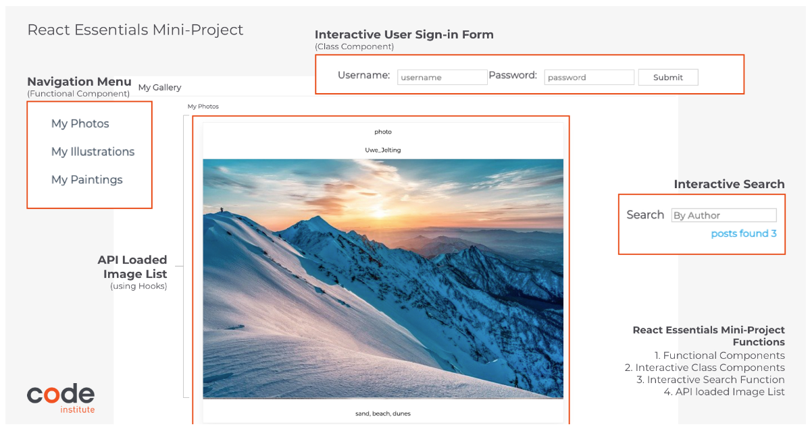
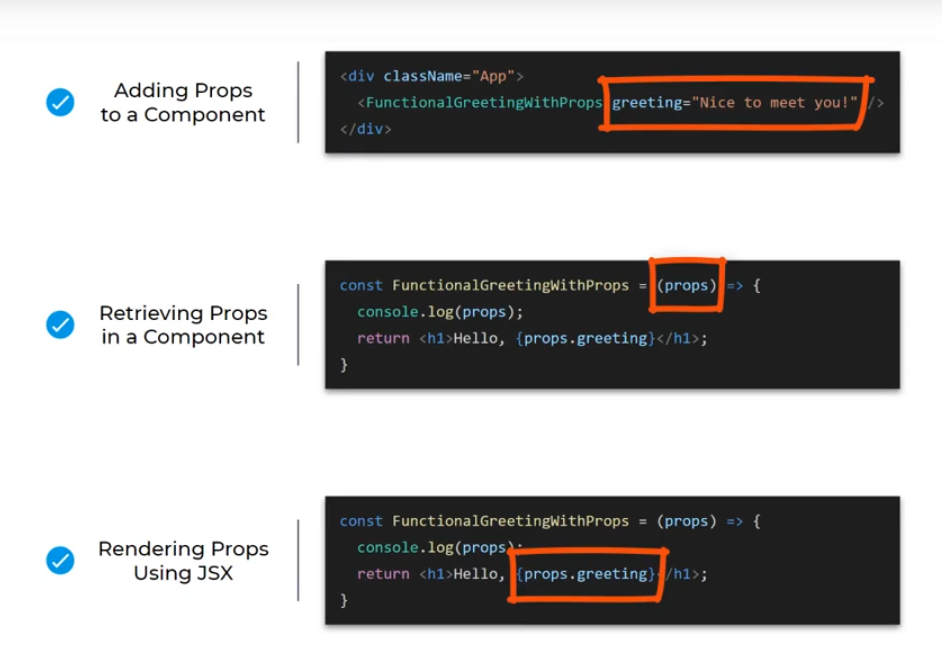

# My First React App


---
## Project Brief
### Project Description
As part of your React journey, you've been hired by a client to develop a frontend portfolio website using React.


**Learning Objectives**
1. Create a *Navigation Menu*
2. Create a *User Sign In form* displaying different content based on user interactions
3. Create an *API-Loaded Image List* complete with title, author and description text
4. Create an *Interactive Search Field*

---
## Overview: Learning how to set up a React Application using a tool called npx
To get the most out of React we need to couple it with an open source, JavaScript runtime called **NodeJS**.
We will be using **node** to:
* run our development server while we're writing React code
* handle transpiling JSX (converting our React code) to vanilla JavaScript so it can run in the browser
* allow us to use the Node Package Manager (npm) to install packages and extensions for our React apps

In the React project example we looked at previously, we used the command `npm start` to start the React app.
**Npm** is a tool that is distributed with NodeJS which allows us to:
* install and uninstall packages
* run a development server
* create and destroy React applications

While it's not an absolute requirement to use Node, React and Node are often tightly coupled, so we'll be using Node and npm throughout this series.

[Learn more about NPM here](https://www.npmjs.com/)

---
## How to create your first React App
* Create a repository on GitHub
* Create a GitPod workspace from it
* Use the npx command inside your workspace to create your react application (node is already installed with GitPod)
`npx create-react-app my-app --use-npm`

❗**npx** executes node packages and comes pre-bundled with **npm** which is pre-bundled with **Node**
These three tools together make it easy to create React applications with this simple `create-react-app` command.

With running the `npx create-react-app my-app --use-npm` command completed, npx has created a react app in the **my-app** folder. Everything that **npm** installed went into the **node_modules** folder and this is where React will look for any packages it needs.

To run the **my-app**: <br/>
`cd my-app`<br/>
`npm start`

Just like that, we now have a complete React app ready to go and we're ready to start creating our own components `create-react-app` is a great little tool that gives us all the boiler plate code needed to start a React app and many  developers like to start here to get their apps up and running, and then just delete anything they don't need and make adjustments as required.

**NOTE:**
* If you are using GitPod, you have to add the `--use-npm` when running the `create-react-app` command because by default, GitPod will use **yarn**, a different package manager.
* To stop the server, use **CTRL/CMD + C**

---
## React Developer Tools
Install React Developer Tools from Chrome Extensions.

The reason we need the React developer tools is because sometimes we want to be able to examine and tweak the actual React application we're building, rather than the HTML it generates.

The first thing to notice with React Developer Tools is that it's a great way to identify a site that uses React. Whenever you're on a site that uses React, the icon will be lit up in either blue or orange.
* 🔷 If it's blue, it means that the site is running the production build of React, which is the optimized version.
* 🔶 If it's orange it means that it's running the unoptimized development version.

---
Next: See [**React Components**](https://github.com/JoyZadan/ci-react-core-react-components)

---
## Writing a Functional Component from scratch
Note: the App function is actually a functional component in itself
```javascript
function App()
```

### Steps:
1. Remove everything from App.js except:
    ```javascript
    import logo from './logo.svg';
    import './App.css';

    function App() {
        return (
            <div className="App">
                <h1>Test it works!</h1>
            </div>
        );
    }

    export default App;
    ```
2. Inside the **src** folder, create a folder called **components**

3. Inside this new **components** folder, create a file and call it **FunctionalGreeting.js** <br/> <u>(Note the use of PascalCase when naming the file. This is standard for naming React components and is required for our app to render correctly.)</u>

4. Import React from react
```javascript
import React from "react";
```

Note: this line gives us access to everything React itself can do, including calling `react.createElement` which is what JSX will use to create all the HTML elements this component will render.

Also note: This line is actually not required in the latest versions of React. Including this line makes our components backwards compatible with earlier versions of React.

5. Create a new function called FunctionalGreeting:
```javascript
function FunctionalGreeting(){
    return <h1>Hello from React!</h1>
}
```
Note: This is a valid functional component but it won't do anything until we include it in the rest of the application by:
* exporting the function from FunctionalGreeting.js:
    ```javascript
    export default FunctionalGreeting
    ```
* importing it where we want to use it, in this case, App.js
    ```javascript
    import FunctionalGreeting from "./components/FunctionalGreeting"
    ```
    * here we reference the file path where this function exists

❗This process of writing a component, exporting it, and then importing it into your main app file is the basis for how we create user interfaces in React. All your components for different parts of the UI will go into your main **App.js**, and  together they make up the whole user interface.

Note: Components that are totally independent and won't have any other content except what it renders itself do not need a closing tag. We just self-close it with a **space** and a **forward slash**. Most components can be rendered this way.
`<FunctionalGreeting /> ` <br/>
In more advanced apps, you'll definitely see components that wrap other components, so to close a component, close it like any other HTML element:
```javascript
<FunctionalGreeting>
    other stuff goes here
</FunctionalGreeting>
```

### Using arrow function to keep our code as modern as possible:
vanilla JS:
```javascript
function FunctionalGreeting() {
    greeting = () => "Hello from React";
}
```
converted to arrow function:
```javascript
const FunctionalGreeting = () => <h1>Hello from React!</h1>;
```

Note on the use of **default** (see line 89) when exporting our component: This is so when we import it, we can  actually do so using any name we want and are not required to import it as **FunctionalGreeting**, though it is convention to do so anyway. There is another alternative called **named exports**,  which we'll learn about as we become more advanced in React development.

---
### Summary
* We learned how to create our first stateless functional component from scratch
* We learned that we can reuse this component over and over simply by expoerting it into the file we wish to use it in.

---
Next: **Adding props to our stateless functional component**

---

## Adding props to our stateless functional component

**Props** (short for properties)
* they are specified as attributes to the component (just like you would specify any other HTML attribute such as class or ID)
* represent the parameters you pass into your React component
* to tell it what it renders
* and how

❗**Steps to Duplicating Components:**
1. Create a duplicate of the functional greeting component
2. Rename it to FunctionalGreetingWithProps
3. Inside the file, change the name of the function, and the name of the export to match
4. Go to App.js, import the FunctionalGreetingWithProps component
5. Then include it underneath the  regular functional greeting component

❗ **Adding a prop:** <br/>
1. In **App.js** file, add a prop called *greeting* and set its value to *Nice to meet you!*
```javascript
<FunctionalGreetingWithProps greeting="Nice to meet you!"/>
```
2. to actually use the new prop, we have to retrieve it in the **FunctionalGreetingWithProps.js** component, see below:
`(props)`

```javascript
const FunctionalGreetingWithProps = (props) => {
    return <h1>Hello! {props.greeting}</h1>;
}

```
3. render it as part of the JSX
`{props.greeting}`

❗<u>Any time  you want to use a prop, a JavaScript variable or any kind of JavaScript expression in your JSX, all you need to do is wrap it in {curly braces}.</u>




**Passing additional props to your component:**
* In the **App.js** file, separate the additional props using spaces:
    ```javascript
    <FunctionalGreetingWithProps greeting="Nice to meet you!" name="Mike" age="32" />
    ```

* In **FunctionalGreetingWithProps.js** component:
    ```javascript
    	const FunctionalGreetingWithProps = (props) => {
            console.log(props);
            return <h1>Hello, {props.name}! I see you're {props.age}; {props.greeting}! </h1>;
        }
    ```

[**Finished Source Code Repo**](https://github.com/Code-Institute-Solutions/gitpod-react/tree/b7e7da047b80911501e57d6dfb9ae090ad4c5dee/my-app/src)

---
Next: **Using Functional Components Challenge**

---

